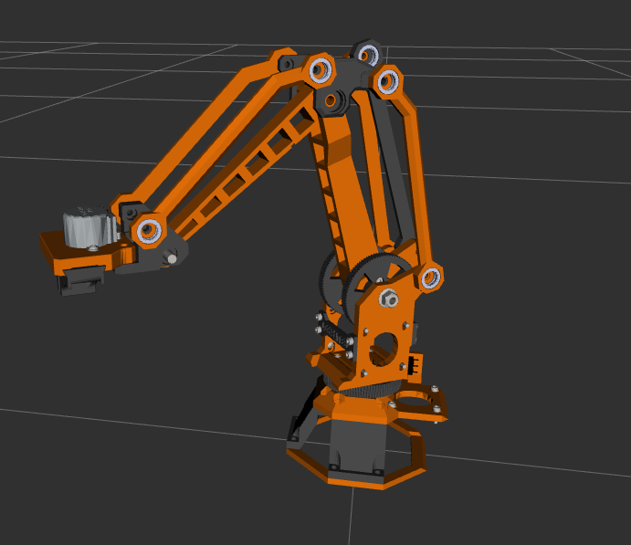

# Topological Navigation: Community Robot Arm (ROS 2)




A ROS 2-based framework for topological motion planning and trajectory optimization applied to the **Community Robot Arm**. This project implements a **"white-box" approach**, modeling the configuration space as a toroidal manifold ($T^3$) and providing a real-time web-based visualizer for manifold monitoring.

## 🌟 Key Features

- **Manifold Monitoring (New):** Real-time 3D visualization of the $T^3$ Configuration Space using Three.js.
- **Topological Planning:** Search algorithms (A* and RRT) that respect the "wrap-around" nature of the Torus.
- **Traceability System:** Live tabular tracking of joint coordinates ($\theta_1, \theta_9, \theta_{10}$) for experimental validation.
- **Voxel-based C-Space:** Dynamic mapping of collision zones within the variety.
- **Dockerized Architecture:** Microservices for ROS 2 (Backend) and Nginx/Three.js (Frontend).

## 🛠️ Unified Workflow (Makefile)

This project uses a centralized `Makefile` to manage the environment. No manual script execution is required.

### 1. Build the System
Compiles ROS 2 packages and builds the Docker images for the Planner and the Dashboard.
```bash
make build
```

### 2. Launch Everything (Master Launch)
Starts the robot simulation, RViz2, the planning agent, and the Web Dashboard.
```bash
make run
```

### 3. Quick Restart
Restarts the containers and the WebSocket bridge if the connection is lost.
```bash
make restart
```

### 4. Cleanup
Deletes build artifacts and temporary logs.
```bash
make clean
```

---

## 🏗️ Robot Asset Pipeline

If you need to update the robot model from Onshape or regenerate the collision geometry, follow this pipeline:

### 1. Onshape Migration
The robot model is exported from Onshape in URDF format and stored in `src/robots/community_robot_arm/oneshape-robot/`. Use the professional migration tool to clean and optimize the model:

```bash
# Generates a cleaned, optimized SLIM model for planning
python3 src/robots/community_robot_arm/scripts/create_urdf.py --mode slim
```
**Features:** Semantic mesh renaming, automatic binary STL conversion, and hardware filtering (removing motors/bolts).

### 2. FOAM Spherization (Collision Approximation)
To generate the "White-Box" collision balls used by the planner, you must process the URDF through the FOAM tool:

1. **Prepare for FOAM:**
   ```bash
   python3 src/robots/community_robot_arm/scripts/add_collisions.py \
       src/robots/community_robot_arm/urdf/raw/community_robot_arm_slim.urdf \
       src/robots/community_robot_arm/urdf/processed/community_robot_arm_with_collisions.urdf
   ```
2. **Run Spherization:**
   ```bash
   docker run -it --rm -v "$(pwd)/src/robots/community_robot_arm:/robot_ws" foam-light \
       --filename /robot_ws/urdf/processed/community_robot_arm_with_collisions.urdf \
       --output /robot_ws/urdf/spherized/community_robot_arm_slim_spherized_v2.urdf
   ```

For more details on the spherization process, see the [FOAM Workflow README](src/tools/foam/README_WORKFLOW.md).

---

## 📺 White-Box Dashboard

Once the system is running (`make run`), you can access the topological monitor at:
👉 **[http://localhost:8080](http://localhost:8080)**

### Visual components:
- **The Cube ($T^3$):** Represents the fundamental domain of the manifold $[-\pi, \pi]^3$.
- **Yellow Trail:** Continuous trajectory history showing the path taken by the robot.
- **Red Voxels:** Forbidden regions in the Configuration Space (C-Obstacles).
- **Traceability Table:** Real-time logging of joint angles for data collection.

---

## ⚙️ Hardware & Kinematics

Built upon the **Community Robot Arm** open-source hardware:
- **Joint 1:** Base Rotation ($\theta_1$)
- **Joint 9:** Lower Arm Linkage ($\theta_9$)
- **Joint 10:** Upper Arm / Wrist ($\theta_{10}$)

The system uses a **Parallelogram Kinematics Solver** to handle the mechanical constraints of the dual-link design, ensuring the end-effector maintains its orientation as defined in the White-Box parameters.

## 📂 Project Structure

```text
ROS2/
├── dashboard/               <-- WEB FRONTEND (Three.js + Nginx)
│   ├── index.html           <-- UI and Traceability Table
│   ├── app.js               <-- Topological 3D Rendering Logic
│   └── Dockerfile           <-- Nginx Microservice
│
├── src/
│   ├── robots/              <-- URDF & Mesh Definitions
│   └── whitebox_planners/   <-- ALGORITHMIC CORE
│       ├── collision/       <-- FOAM & Voxelization Logic
│       ├── planners/        <-- A* and RRT on Manifolds
│       └── ros2/            <-- Planner & Voxelizer Nodes
│
├── Tesis/                   <-- ACADEMIC DOCUMENTATION (LaTeX)
├── Makefile                 <-- Unified Command Center
└── docker-compose.yml       <-- Multi-container Orchestration
```

---

## 👨‍🔬 Author
**Roberto Carlos Vazquez Nava**  
*Research Project: UnADM x TESH collaboration.*
