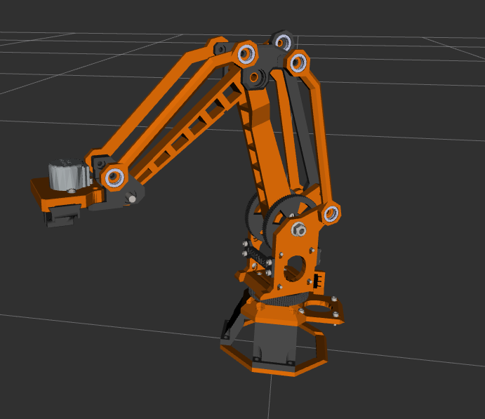

# Topological Navigation: Community Robot Arm (ROS 2)




A ROS 2-based framework for topological motion planning and trajectory optimization applied to the **Community Robot Arm**. This project implements a **"white-box" approach**, modeling the configuration space as a toroidal manifold ($T^3$) and providing a real-time web-based visualizer for manifold monitoring.

## 🌟 Key Features

- **Manifold Monitoring (New):** Real-time 3D visualization of the $T^3$ Configuration Space using Three.js.
- **Topological Planning:** Search algorithms (A* and RRT) that respect the "wrap-around" nature of the Torus.
- **Traceability System:** Live tabular tracking of joint coordinates ($\theta_1, \theta_9, \theta_{10}$) for experimental validation.
- **Voxel-based C-Space:** Dynamic mapping of collision zones within the variety.
- **Dockerized Architecture:** Microservices for ROS 2 (Backend) and Nginx/Three.js (Frontend).

## 🛠️ Unified Workflow (Makefile)

This project uses a centralized `Makefile` to manage the environment. No manual script execution is required.

### 1. Build the System
Compiles ROS 2 packages and builds the Docker images for the Planner and the Dashboard.
```bash
make build
```

### 2. Launch Everything (Master Launch)
Starts the robot simulation, RViz2, the planning agent, and the Web Dashboard.
```bash
make run
```

> [!IMPORTANT]
> **GUI & RViz2 Authorization (X11):**
> If you run `make run` or `make run-cpu` and the RViz2 window does not appear (with errors in logs like `qt.qpa.xcb: could not connect to display`), you need to authorize the Docker container to access your host's X server by running this command on your host machine:
> ```bash
> xhost +local:docker
> ```
> *(Or simply `xhost +` if needed).*

> [!TIP]
> **Soporte de GPU NVIDIA y Alternativa en CPU (Error `could not select device driver "nvidia"`):**
> Si al ejecutar `make run` se produce el error `Error response from daemon: could not select device driver "nvidia" with capabilities: [[gpu]]`, significa que el sistema host no tiene instalado o configurado el **NVIDIA Container Toolkit**.
> 
> Tienes dos opciones para solucionarlo:
> 
> 1. **Ejecutar en modo solo CPU (No requiere GPU ni configuraciones adicionales):**
>    ```bash
>    make run-cpu
>    ```
>    *Nota: Como el espacio de configuración ya está precalculado en el directorio `cspace_cache/`, la planificación y visualización funcionarán perfectamente en CPU.*
> 
> 2. **Instalar el NVIDIA Container Toolkit en tu máquina host para habilitar GPU:**
>    Si deseas restaurar el soporte de GPU en Docker, ejecuta los siguientes comandos en tu terminal local:
>    ```bash
>    # Configurar el repositorio oficial de NVIDIA
>    curl -fsSL https://nvidia.github.io/libnvidia-container/gpgkey | sudo gpg --dearmor -o /usr/share/keyrings/nvidia-container-toolkit-keyring.gpg \
>      && curl -s -L https://nvidia.github.io/libnvidia-container/stable/deb/nvidia-container-toolkit.list | \
>        sed 's#deb https://#deb [signed-by=/usr/share/keyrings/nvidia-container-toolkit-keyring.gpg] https://#g' | \
>        sudo tee /etc/apt/sources.list.d/nvidia-container-toolkit.list
>    
>    # Instalar el paquete
>    sudo apt update && sudo apt install -y nvidia-container-toolkit
>    
>    # Configurar el runtime en Docker y reiniciar el servicio
>    sudo nvidia-ctk runtime configure --runtime=docker
>    sudo systemctl restart docker
>    ```
>    Una vez hecho esto, puedes verificar que Docker reconozca el runtime ejecutando `docker info | grep -i runtime` (debería aparecer `nvidia` en la lista). Luego podrás usar `make run` con normalidad.


### 3. Quick Restart
Restarts the containers and the WebSocket bridge if the connection is lost.
```bash
make restart
```

### 4. Cleanup
Deletes build artifacts and temporary logs.
```bash
make clean
```

---

## 🏗️ Robot Asset Pipeline

If you need to update the robot model from Onshape or regenerate the collision geometry, follow this pipeline:

### 1. Onshape Migration
The robot model is exported from Onshape in URDF format and stored in `src/robots/community_robot_arm/oneshape-robot/`. Use the professional migration tool to clean and optimize the model:

```bash
# Generates a cleaned, optimized SLIM model for planning
python3 src/robots/community_robot_arm/scripts/create_urdf.py --mode slim
```
**Features:** Semantic mesh renaming, automatic binary STL conversion, and hardware filtering (removing motors/bolts).

### 2. FOAM Spherization (Collision Approximation)
To generate the "White-Box" collision balls used by the planner, you must process the URDF through the FOAM tool:

1. **Prepare for FOAM:**
   ```bash
   python3 src/robots/community_robot_arm/scripts/add_collisions.py \
       src/robots/community_robot_arm/urdf/raw/community_robot_arm_slim.urdf \
       src/robots/community_robot_arm/urdf/processed/community_robot_arm_with_collisions.urdf
   ```
2. **Run Spherization:**
   ```bash
   docker run -it --rm -v "$(pwd)/src/robots/community_robot_arm:/robot_ws" foam-light \
       --filename /robot_ws/urdf/processed/community_robot_arm_with_collisions.urdf \
       --output /robot_ws/urdf/spherized/community_robot_arm_slim_spherized_v2.urdf
   ```

For more details on the spherization process, see the [FOAM Workflow README](src/tools/foam/README_WORKFLOW.md).

---

## 📺 White-Box Dashboard

Once the system is running (`make run`), you can access the topological monitor at:
👉 **[http://localhost:8080](http://localhost:8080)**

### Visual components:
- **The Cube ($T^3$):** Represents the fundamental domain of the manifold $[-\pi, \pi]^3$.
- **Yellow Trail:** Continuous trajectory history showing the path taken by the robot.
- **Red Voxels:** Forbidden regions in the Configuration Space (C-Obstacles).
- **Traceability Table:** Real-time logging of joint angles for data collection.

---

## 🔄 Planning & Trajectory Pipeline

This system bridges a 3D web-based interface with high-fidelity ROS 2 topological solvers and dynamic trajectory generation. The sequential execution flow operates as follows:

1. **Dashboard Command Generation**: The user defines a sequence of target waypoints on the Web Dashboard. When execution is triggered, the dashboard broadcasts a structured JSON command over WebSockets via the ROS Bridge.
2. **ROS 2 Node Reception**: The `topological_planner_node` intercepts the JSON command. It dynamically updates the active search parameters (e.g., switching between A* or RRT planning, and L1 or L2 geodetic metrics) and writes the target points to a temporary waypoint configuration file.
3. **Topological Search (C-Space)**: The planning node discretizes the continuous waypoint coordinates onto a toroidal grid matching the configuration space resolution. The selected planner searches for a collision-free path segment-by-segment:
   - It computes geodetic distances on the toroidal manifold ($T^3$), accounting for periodic wrap-arounds.
   - It performs collision validation at each node using the spherized robot geometry (via the FOAM solver cache) and environment obstacles.
4. **Trajectory Suavization (C2 Splines)**: The raw geometric path outputted by the planner is a sequence of discrete segments. To prevent sharp speed changes, this path is processed by a Trajectory Generator that interpolates the path using quintic (5th-order) splines. This ensures continuous velocity and acceleration profiles ($C^2$ continuity), keeping the over-acceleration (*jerk*) bounded.
5. **High-Frequency Visual Execution**: An execution timer processes the continuous trajectory at a high rate (50 Hz). At each tick, the current interpolated joint positions are published to ROS 2 topics. RViz2 and the Web Dashboard subscribe to these states to render smooth, real-time 3D animation, drawing a trail of the end-effector path in the workspace.

---

## ⚙️ Hardware & Kinematics

Built upon the **Community Robot Arm** open-source hardware:
- **Joint 1:** Base Rotation ($\theta_1$)
- **Joint 9:** Lower Arm Linkage ($\theta_9$)
- **Joint 10:** Upper Arm / Wrist ($\theta_{10}$)

The system uses a **Parallelogram Kinematics Solver** to handle the mechanical constraints of the dual-link design, ensuring the end-effector maintains its orientation as defined in the White-Box parameters.

## 📂 Project Structure

```text
ROS2/
├── dashboard/               <-- WEB FRONTEND (Three.js + Nginx)
│   ├── index.html           <-- UI and Traceability Table
│   ├── app.js               <-- Topological 3D Rendering Logic
│   └── Dockerfile           <-- Nginx Microservice
│
├── src/
│   ├── robots/              <-- URDF & Mesh Definitions
│   └── whitebox_planners/   <-- ALGORITHMIC CORE
│       ├── collision/       <-- FOAM & Voxelization Logic
│       ├── planners/        <-- A* and RRT on Manifolds
│       └── ros2/            <-- Planner & Voxelizer Nodes
│
├── Tesis/                   <-- ACADEMIC DOCUMENTATION (LaTeX)
├── Makefile                 <-- Unified Command Center
└── docker-compose.yml       <-- Multi-container Orchestration
```

---

## 👨‍🔬 Author
**Roberto Carlos Vazquez Nava**  
*Research Project: UnADM x TESH collaboration.*
