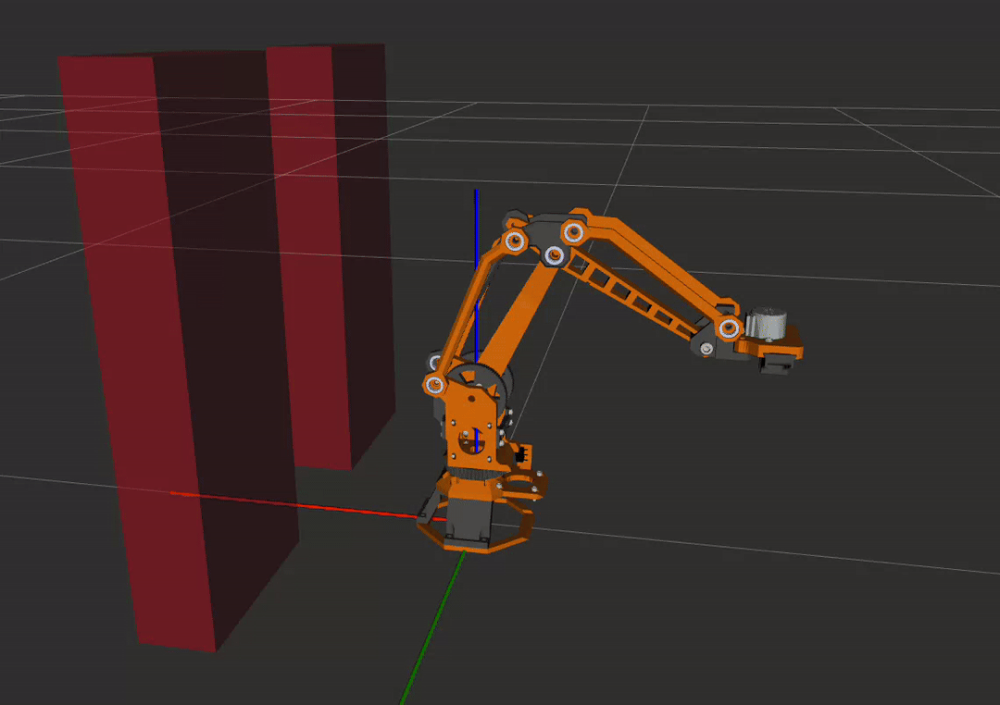

# Topological Navigation: Community Robot Arm (ROS 2)





A ROS 2-based framework for topological motion planning, C-Space voxelization, and trajectory optimization applied to the **Community Robot Arm**. 

This project implements an explainable **"white-box" approach**, modeling the 3-DOF robot configuration space as a toroidal 3-manifold ($T^3 = S^1 \times S^1 \times S^1$). It bridges a high-speed parallel C-Space solver written in **Rust** with ROS 2 planning nodes (A* and RRT) and an interactive **Three.js + React web dashboard** for real-time manifold monitoring.

---

## 🌟 Key Features

- **White-Box $T^3$ Manifold Monitoring**: Interactive real-time 3D web visualization of the configuration space torus $[-\pi, \pi]^3$ using Three.js and React.
- **Topological Motion Planning**: Geodetic search algorithms (A* and RRT) with Manhattan ($L_1$) and Euclidean ($L_2$) metrics respecting toroidal wrap-around boundary conditions.
- **On-the-Fly C-Space Voxelization**: High-performance parallel collision solver compiled in **Rust** capable of evaluating 13,824 states in under 0.8 seconds.
- **Dynamic Obstacle Repositioning**: Live preview of dynamic environment obstacles in RViz2 without recalculating C-Space, with instant on-demand C-Space updating.
- **Analytical Kinematics & $C^2$ Trajectories**: Closed-form inverse kinematics for 3-DOF closed-loop parallelogram mechanisms, smoothed via 5th-order (quintic) splines.
- **Full Traceability & Analytics**: Real-time logging of joint coordinates, workspace position ($XYZ$), manipulability indices ($\omega$), and CSV export.
- **Containerized Architecture**: Docker microservices managed by a single `Makefile` for zero-configuration setup.

---

## 🧠 Key concepts (before you dive in)

Before exploring the codebase, it is helpful to understand the theoretical foundation of white-box topological motion planning.

### 1. Configuration space ($T^3$ torus topology)
A 3-DOF rotational robot arm with angular joint limits $[-\pi, \pi]$ lives naturally on a 3-dimensional toroidal manifold:
$$T^3 = S^1 \times S^1 \times S^1$$
Topological motion planning treats the configuration space as a continuous topological space where path search algorithms (A* and RRT) account for periodic boundary wrap-around ($-\pi \equiv \pi$) along every joint dimension.

### 2. White-box vs. black-box motion planning
Traditional "black-box" planners (e.g. MoveIt / OMPL) query collision functions as opaque boolean predicates during node expansion. In contrast, this "white-box" framework explicitly computes, discretizes, and visualizes forbidden collision regions ($C_{obs}$) within the $T^3$ manifold geometry. This provides full analytical explainability of why paths pass through specific topological passages.

### 3. FOAM (spherization of robot geometry)
To compute collision manifolds efficiently, the robot link geometries are processed using **FOAM (Fast Open Approximation of Manifolds)**. Complex STL meshes are converted into overlapping open ball coverings $B(p, r) \subset \mathbb{R}^3$. Collision detection between links or obstacles reduces to fast Euclidean distance evaluations between sphere pairs.

### 4. Voxel discretization & cache system
The continuous manifold $[-\pi, \pi]^3$ is discretized into integer grid cells according to a configurable step size (e.g. $15^\circ$ grid). A parallel C-Space solver evaluates all grid states and generates a forbidden voxel set $C_{obs}$. During path planning, checking if a state is collision-free is reduced to a fast $O(1)$ set lookup in RAM.

---

## 🏛️ Architecture overview

The system is structured as a containerized microservice ecosystem combining ROS 2 nodes, a compiled Rust solver binary, and a web-based React/Three.js dashboard connected via WebSockets.

```text
               +-------------------------------------------+
               |        Web Dashboard (React + Three.js)   |
               |       - 3D Torus Manifold Visualizer      |
               |       - Joint & Cartesian Control Panels  |
               +---------------------+---------------------+
                                     |
                          JSON over WebSockets
                                     v
               +---------------------+---------------------+
               |         rosbridge_websocket Node          |
               +---------------------+---------------------+
                                     |
                            ROS 2 Topics & TFs
                                     v
       +-----------------------------+-----------------------------+
       |                                                           |
       v                                                           v
+-------------------------------+               +-------------------------------+
|     cspace_publisher Node     |               |    topological_planner_node   |
| - Computes C-space via Rust   |               | - A* & RRT planning on T^3    |
| - Publishes /cspace_voxels    | ------------> | - Synchronizes C-space cache  |
| - Manages URDF descriptions   |               | - Trajectory generator (C^2)  |
+---------------+---------------+               +---------------+---------------+
                |                                               |
                v                                               v
+-------------------------------+               +-------------------------------+
|     Rust C-Space Solver       |               |    RViz2 & State Publishers   |
| - Multi-threaded evaluator    |               | - 3D Robot & Obstacle Mesh    |
| - Evaluates 13,824 states/sec |               | - Dynamic TF (/tf) @ 10 Hz    |
+-------------------------------+               +-------------------------------+
```

### 1. ROS 2 Nodes (`whitebox_motion_planners`)
- `cspace_publisher` (Voxelizer node): Computes and caches $C_{obs}$ forbidden states using the Rust solver, publishes voxel data on `/cspace_voxels`, and broadcasts obstacle URDF descriptions on `/obstacles_description`.
- `planning_node` (Motion planner node): Subscribes to `/web_commands` and `/cspace_voxels`, runs topological A* and RRT algorithms on the $T^3$ grid, generates $C^2$ continuous quintic spline trajectories, and publishes joint trajectories at 50 Hz.
- `robot_state_publisher` & `joint_state_publisher`: Manage 3D robot arm kinematic frames and publish state transforms.
- `rosbridge_websocket`: Provides two-way WebSocket communication between ROS 2 topics and the web application.

### 2. Web dashboard (React + Three.js)
- **3D viewport**: Renders the $[-\pi, \pi]^3$ fundamental domain box, forbidden C-space voxel cubes ($C_{obs}$), real-time robot state indicator, and executed trajectory trails.
- **Control panels**: Supports joint angle sliders, Cartesian end-effector positioning with analytical inverse kinematics, waypoint list management, planner algorithm selection (A* / RRT, $L_1$ / $L_2$ heuristics), and live obstacle repositioning.

### 3. Rust parallel C-Space solver (`cspace_solver`)
A compiled high-performance binary in `src/tools/cspace_solver` that receives URDF joint matrices and obstacle sphere coordinates via stdin JSON, evaluates all $T^3$ grid states across available CPU threads in parallel, and returns forbidden state arrays in under 0.8 seconds.

### 4. Robot asset & URDF pipeline
- **Onshape migration**: Raw CAD exports are processed using `src/robots/community_robot_arm/scripts/create_urdf.py` to generate optimized slim models.
- **FOAM spherization**: Spherized URDF files located in `src/robots/community_robot_arm/urdf/spherized/` define the bounding sphere coverings for collision checking.
- **Obstacle URDFs**: Modular environment obstacle URDFs (`box_obstacle`, `narrow_passage`, `u_obstacle`, `toroidal_wall`).

---

## 📋 Prerequisites

Before building or running the project, ensure your environment meets the following requirements:

- **Operating system**: Linux (Ubuntu 20.04 / 22.04 recommended) with X11 windowing system.
- **Docker engine & Docker Compose**: Installed and configured for your user.
- **X11 Display Authorization**: Required for containerized RViz2 windows to render on the host screen.
- **(Optional) NVIDIA GPU & Container Toolkit**: For GPU hardware acceleration in rendering.

---

## 🛠️ Unified workflow (quick start)

This project uses a centralized `Makefile` to manage container compilation, ROS 2 workspace building, and service launching. No manual terminal script execution is required.

### 1. Build the system
Compiles ROS 2 packages inside the workspace and builds Docker microservice images for the planner and web dashboard.
```bash
make build
```

### 2. Launch everything (master launch)
Starts the robot simulation, RViz2, motion planning node, rosbridge WebSocket server, and Three.js web dashboard.
```bash
make run
```

> [!IMPORTANT]
> **GUI & RViz2 display authorization (X11):**
> If you run `make run` or `make run-cpu` and the RViz2 window does not appear (with log errors like `qt.qpa.xcb: could not connect to display`), authorize Docker to access your host X11 server by running this command on your host machine:
> ```bash
> xhost +local:docker
> ```
> *(Or simply `xhost +` if needed).*

> [!TIP]
> **NVIDIA GPU support and CPU fallback (Error `could not select device driver "nvidia"`):**
> If running `make run` fails with `Error response from daemon: could not select device driver "nvidia" with capabilities: [[gpu]]`, your host machine does not have the **NVIDIA Container Toolkit** installed or configured.
> 
> You have two options:
> 
> 1. **Run in CPU-only mode (No GPU or setup required):**
>    ```bash
>    make run-cpu
>    ```
>    *Note: Pre-computed C-Space maps are cached in `cspace_cache/`, so planning and visualization function at full speed on CPU.*
> 
> 2. **Install NVIDIA Container Toolkit on host machine:**
>    To enable GPU hardware acceleration in Docker, execute the following commands locally:
>    ```bash
>    # Configure official NVIDIA repository key and package list
>    curl -fsSL https://nvidia.github.io/libnvidia-container/gpgkey | sudo gpg --dearmor -o /usr/share/keyrings/nvidia-container-toolkit-keyring.gpg \
>      && curl -s -L https://nvidia.github.io/libnvidia-container/stable/deb/nvidia-container-toolkit.list | \
>        sed 's#deb https://#deb [signed-by=/usr/share/keyrings/nvidia-container-toolkit-keyring.gpg] https://#g' | \
>        sudo tee /etc/apt/sources.list.d/nvidia-container-toolkit.list
>    
>    # Install package
>    sudo apt update && sudo apt install -y nvidia-container-toolkit
>    
>    # Configure Docker runtime and restart service
>    sudo nvidia-ctk runtime configure --runtime=docker
>    sudo systemctl restart docker
>    ```
>    Verify setup via `docker info | grep -i runtime` (should list `nvidia`). You can then run `make run`.

### 3. Quick restart
Restarts container services and the WebSocket bridge if connection to ROS 2 is interrupted.
```bash
make restart
```

### 4. Cleanup
Stops running containers and removes build cache artifacts.
```bash
make clean
```

---

## ⚙️ Configuration reference

System behavior, kinematic joint offsets, grid resolutions, and planner parameters are configured in:
`src/whitebox_motion_planners/config/planner_params.yaml`

```yaml
/**:
  ros__parameters:
    # Robot model selection ("community_arm" or "open_manipulator")
    robot_type: "community_arm"

    # Angle unit configuration (true = degrees, false = radians)
    angles_in_degrees: true

    # Start configuration (Point A)
    use_static_start: true
    start:
      - 180.0   # Base yaw (q1)
      - 150.0   # Shoulder pitch (q2)
      - 90.0    # Elbow pitch (q3)

    # Grid discretization resolution (lower values yield finer manifolds but larger caches)
    step_size_deg: 15.0

    # Singularity avoidance threshold (Yoshikawa index, 0.0 = disabled)
    singularity_threshold: 0.0005

    # Trajectory animation publishing rate in Hz
    animation_rate_hz: 50.0

    # Bounding sphere thinning threshold for URDF collision models (in meters)
    sphere_thinning_dist: 0.015

    # Planner algorithm and heuristic metric (runtime overridden via Web Dashboard)
    planner_type: "astar"    # "astar" or "rrt"
    heuristic_type: "L1"     # "L1" (Manhattan) or "L2" (Euclidean)

    # RRT algorithm parameters
    rrt:
      max_samples: 10000
      step_size: 0.15
      goal_bias: 0.05
      goal_tolerance: 0.2

    # Environment obstacle settings
    use_obstacles: true
    obstacle_type: "toroidal_wall"  # "box_obstacle", "narrow_passage", "u_obstacle", "toroidal_wall"

    # Joint transformation offsets and orientation multipliers relative to world axes
    joint_offsets:
      base_yaw: 32.0694
      shoulder_pitch: 110.507
      elbow_pitch: 300.0
    joint_directions:
      base_yaw: -1
      shoulder_pitch: -1
      elbow_pitch: 1
```

> [!NOTE]
> Parameters such as `planner_type`, `heuristic_type`, `step_size_deg`, and active obstacle types can be dynamically overridden at runtime from the **Web Dashboard** without restarting ROS 2 nodes.

---

## 💾 C-Space cache system

To avoid recomputing 13,824 collision states during every launch, pre-evaluated forbidden voxel maps are stored as JSON files in the `cspace_cache/` directory.

### 1. Cache file naming convention
Cache filenames use a deterministic hash encoding the grid resolution, thinning distance, obstacle geometry, and singularity threshold:
```text
cspace_cache_{step_size_deg}deg_{sphere_thinning_dist}m_{obstacles_hash}_singularity{singularity_threshold}.json
```
*Example:* `cspace_cache_15.0deg_0.015m_3dab0f26_singularity0.0005.json`

### 2. JSON structure
```json
{
  "forbidden_voxels": [[-3.142, 1.571, 0.785], ...],
  "self_collision_voxels": [[-3.142, 1.571, 0.785], ...],
  "obstacle_voxels": [[-1.571, 0.262, -0.524], ...],
  "singularity_voxels": [],
  "step_rad": 0.2617993877991494
}
```

### 3. Cache loading & on-the-fly evaluation workflow
1. **Startup / obstacle switch**: When an obstacle mode (e.g. `narrow_passage`) or grid resolution ($15^\circ$) is selected, `cspace_publisher` checks if a matching JSON cache file exists in `cspace_cache/`.
2. **Cache hit**: If found, voxels are loaded into RAM in **< 0.05 seconds** and broadcasted to both the visualizer (`ThreeVisualizer.jsx`) and planner node (`planning_node.py`).
3. **Cache miss / custom position**: When a custom obstacle position is applied via **"Apply position"** in the Web Dashboard, `cspace_publisher` triggers the parallel **Rust C-Space solver**, evaluates the updated manifold in **~0.7 seconds**, saves the new JSON cache to disk, and updates the planner instantly.

---

## 🔄 Planning & trajectory pipeline

The system bridges a 3D web dashboard with high-fidelity ROS 2 topological solvers and dynamic trajectory generators:

1. **Dashboard command generation**: The user selects waypoints or targets in the Web Dashboard. Clicking **"Execute sequence"** serializes a JSON command sent over WebSockets via `rosbridge_websocket`.
2. **ROS 2 command reception**: `planning_node.py` receives `/web_commands`, dynamically updates planner parameters (A* / RRT, $L_1$ / $L_2$ heuristics), and sets the target search points.
3. **Topological search ($T^3$ C-space)**: The discretized toroidal grid handles boundary wrap-around ($-\pi \equiv \pi$). The selected solver performs $O(1)$ set lookups against `forbidden_set` to find an optimal collision-free path segment-by-segment in **~5 milliseconds**.
4. **$C^2$ Quintic spline smoothing**: Discrete geometric grid paths are converted into smooth continuous trajectories using 5th-order (quintic) splines, guaranteeing continuous velocity ($\dot{q}$) and acceleration ($\ddot{q}$) profiles while bounding jerk.
5. **High-frequency 50 Hz execution**: A timer publishes interpolated joint states to ROS 2 topics (`/joint_states`). RViz2 and `ThreeVisualizer.jsx` render smooth 3D movement and workspace end-effector trails in real-time.

---

## 🎯 Dynamic obstacle positioning

The framework supports real-time dual-phase obstacle repositioning:

```text
[Slider Drag] ------> Action: "preview_obstacle" -----> Live TF Broadcast (/tf @ 10 Hz) -----> RViz2 3D Repaint (No C-Space re-calc)
[Apply Position] ---> Action: "move_obstacle" --------> Rust Parallel Solver (~0.7s) -----------> /cspace_voxels updated -> Planner Cache (5ms planning)
```

### 1. Live preview mode (slider dragging)
- Dragging $X, Y, Z$ sliders in `ObstaclePositioner.jsx` sends JSON commands with action `preview_obstacle`.
- Both `cspace_publisher` and `planning_node` shift URDF joint origins in RAM and publish dynamic transformations on `/tf` at 10 Hz.
- **RViz2 repaints the 3D obstacle model instantly in real-time** without triggering heavy C-Space recalculations.

### 2. On-the-fly C-space calculation mode (apply position)
- Clicking **"Apply position"** sends action `move_obstacle`.
- `cspace_publisher` executes `/home/ros_ws/src/tools/cspace_solver/target/release/cspace_solver` in Rust, evaluating 13,824 states in **~0.7 seconds**.
- The updated forbidden voxels are published over `/cspace_voxels` to `planning_node.py`, synchronizing its `forbidden_set` cache.
- The web visualizer displays `COMPUTING C-SPACE ON-THE-FLY` overlay during calculation.

---

## ⚙️ Kinematics & mechanism math

Built upon the open-source **Community Robot Arm** 3-DOF hardware:
- **Joint 1 ($\theta_1$)**: Base rotation (Yaw)
- **Joint 9 ($\theta_9$)**: Lower arm linkage (Pitch 1)
- **Joint 10 ($\theta_{10}$)**: Upper arm / wrist linkage (Pitch 2)

### 1. Parallelogram linkage kinematics
The arm uses a dual-link mechanical linkage that maintains end-effector parallel orientation. The kinematic model implements coupled coordinate transformations:
$$\theta_{\text{elbow\_urdf}} = -\theta_{\text{shoulder\_urdf}} - \theta_{\text{wrist\_relative}}$$

### 2. Closed-form analytical IK solver (`ik_solver.py`)
Given a target Cartesian coordinate $(X, Y, Z)$ in meters, the analytical solver computes exact joint angles $(q_1, q_2, q_3)$ in closed form without iterative numerical convergence drift:
1. $q_1 = \text{atan2}(Y, X)$ (Base yaw)
2. Radial reach $R = \sqrt{X^2 + Y^2} - d_{\text{gripper\_dx}}$, $Z' = Z - h_{\text{base\_height}} - d_{\text{gripper\_dz}}$
3. Solves lower and upper linkage triangles using the Law of Cosines to obtain $q_2$ and $q_3$.

### 3. Singularity avoidance (Yoshikawa index)
The manipulability index $\omega(q)$ measures kinematic dexterity:
$$\omega(q) = \sqrt{\det(J(q) J^T(q))}$$
States with $\omega(q) < \text{singularity\_threshold}$ (default: $0.0005$) are marked as singular and automatically added to $C_{obs}$ forbidden states to protect hardware from infinite joint velocities.

---

## 📂 Project structure

```text
ROS2/
├── dashboard/               <-- WEB FRONTEND (React + Three.js + Vite)
│   ├── src/
│   │   ├── components/      <-- UI panels (ThreeVisualizer, ControlPanel, ObstaclePositioner...)
│   │   ├── services/        <-- ros.js (ROS 2 WebSocket bridge)
│   │   └── utils/           <-- Client-side kinematics & transformations
│   ├── index.html           <-- Main dashboard shell
│   ├── index.css            <-- Industrial dark design system
│   └── Dockerfile           <-- Nginx container deployment
│
├── src/
│   ├── robots/              <-- URDF & MESH DEFINITIONS
│   │   └── community_robot_arm/
│   │       ├── urdf/spherized/obstacles/  <-- Dynamic environment obstacle URDFs
│   │       └── scripts/                   <-- CAD migration & FOAM processing scripts
│   │
│   ├── tools/
│   │   ├── cspace_solver/   <-- High-speed multi-threaded Rust C-Space binary
│   │   └── foam/            <-- Bounding sphere coverage generator tool
│   │
│   └── whitebox_motion_planners/          <-- ALGORITHMIC CORE
│       ├── collision/       <-- FoamCollider, GridDiscretizer, UrdfCollisionParser
│       ├── kinematics/      <-- Analytical FK, IK solver, quintic trajectory generator
│       ├── planners/        <-- Topological A*, RRT, PlannerFactory
│       ├── spaces/          <-- TorusTopology (T^3 wrap-around math)
│       └── ros2/            <-- planning_node.py, cspace_publisher.py
│
├── cspace_cache/            <-- Pre-computed forbidden voxel JSON maps
├── experiments/             <-- Automated benchmark scripts & performance analytics
├── docs/                    <-- Mathematical & kinematic technical documentation
├── Makefile                 <-- Unified command center
├── Dockerfile               <-- Main ROS 2 environment container
└── docker-compose.yml       <-- Microservices orchestration
```

---

## 🏗️ Robot Asset Pipeline

If you need to update the robot model from Onshape or regenerate the collision geometry, follow this pipeline:

### 1. Onshape Migration
The robot model is exported from Onshape in URDF format and stored in `src/robots/community_robot_arm/oneshape-robot/`. Use the professional migration tool to clean and optimize the model:

```bash
# Generates a cleaned, optimized SLIM model for planning
python3 src/robots/community_robot_arm/scripts/create_urdf.py --mode slim
```
**Features:** Semantic mesh renaming, automatic binary STL conversion, and hardware filtering (removing motors/bolts).

### 2. FOAM Spherization (Collision Approximation)
To generate the "White-Box" collision balls used by the planner, you must process the URDF through the FOAM tool:

1. **Prepare for FOAM:**
   ```bash
   python3 src/robots/community_robot_arm/scripts/add_collisions.py \
       src/robots/community_robot_arm/urdf/raw/community_robot_arm_slim.urdf \
       src/robots/community_robot_arm/urdf/processed/community_robot_arm_with_collisions.urdf
   ```
2. **Run Spherization:**
   ```bash
   docker run -it --rm -v "$(pwd)/src/robots/community_robot_arm:/robot_ws" foam-light \
       --filename /robot_ws/urdf/processed/community_robot_arm_with_collisions.urdf \
       --output /robot_ws/urdf/spherized/community_robot_arm_slim_spherized_v2.urdf
   ```

For more details on the spherization process, see the [FOAM Workflow README](src/tools/foam/README_WORKFLOW.md).

---

## 🧪 Running experiments & benchmarks

The repository includes automated experiment sweeps and benchmark scripts in the `experiments/` directory:

### 1. Automated planner benchmarks (`run_benchmarks.py`)
Runs performance benchmarks comparing A* vs. RRT algorithms across Manhattan ($L_1$) and Euclidean ($L_2$) metrics:
```bash
python3 experiments/run_benchmarks.py
```
- Measures planning time (ms), node expansions, path length, and success rate.
- Evaluates collision check speeds against pre-computed C-Space maps.

### 2. Experiment sweeps (`run_experiments.py`)
Executes parameter sweeps across different grid resolutions ($5^\circ, 10^\circ, 15^\circ$) and obstacle scenarios:
```bash
python3 experiments/run_experiments.py
```

### 3. Result analysis & thesis table generation (`print_thesis_tables.py`)
Formats benchmark data into Markdown and LaTeX tables:
```bash
python3 experiments/print_thesis_tables.py
```

---

## 🧩 Extending the project

### 1. Adding a new environment obstacle
1. Create a spherized URDF file in `src/robots/community_robot_arm/urdf/spherized/obstacles/my_obstacle_spherized.urdf`.
2. Register the default initial position in `dashboard/src/components/ObstaclePositioner.jsx`:
   ```javascript
   const DEFAULT_POSITIONS = {
       ...
       my_obstacle: { x: 0.30, y: 0.00, z: 0.15 }
   };
   ```
3. Update `planner_params.yaml` with the new obstacle identifier:
   ```yaml
   obstacle_type: "my_obstacle"
   ```

### 2. Adding a new planning algorithm
1. Implement the planner class inheriting from `BasePlanner` in `src/whitebox_motion_planners/whitebox_motion_planners/planners/my_planner.py`.
2. Register the planner in `PlannerFactory` (`src/whitebox_motion_planners/whitebox_motion_planners/planners/planner_factory.py`):
   ```python
   elif planner_type == "my_planner":
       return MyPlanner(...)
   ```

### 3. Adding a new robot model
1. Implement kinematics class inheriting from `BaseKinematics` in `src/whitebox_motion_planners/whitebox_motion_planners/kinematics/my_robot.py`.
2. Register the kinematics class in `KinematicsFactory` (`src/whitebox_motion_planners/whitebox_motion_planners/kinematics/factory.py`).
3. Add spherized URDF in `src/robots/my_robot/` and set `robot_type: "my_robot"` in `planner_params.yaml`.

---

## 📺 Web dashboard interface

Once the system is running (`make run` or `make run-cpu`), access the interactive topological monitor in your browser:
👉 **[http://localhost:8080](http://localhost:8080)**

- **The $T^3$ fundamental domain box**: Interactive 3D view of $[-\pi, \pi]^3$.
- **Red voxel cubes**: Forbidden collision regions ($C_{obs}$).
- **Yellow path trail**: Continuous end-effector trajectory trace.
- **Traceability table**: Real-time logging of joint coordinates, end-effector position, and manipulability indices.

---

## 🛠️ Makefile reference

| Target | Description |
|---|---|
| `make build` | Compiles ROS 2 packages and builds Docker microservice images. |
| `make run` | Starts ROS 2 simulation, RViz2, planner node, and dashboard with GPU support. |
| `make run-cpu` | Starts full system in CPU-only mode (ideal when NVIDIA container toolkit is unavailable). |
| `make restart` | Restarts container microservices and rosbridge WebSocket server. |
| `make clean` | Stops containers and removes build cache artifacts. |

---

## ❓ Troubleshooting

### 1. RViz2 window does not appear (`qt.qpa.xcb: could not connect to display`)
Run the following X11 authorization command on your host Linux machine:
```bash
xhost +local:docker
```

### 2. NVIDIA GPU error (`could not select device driver "nvidia"`)
Run in CPU-only mode:
```bash
make run-cpu
```
Or install the NVIDIA Container Toolkit as documented in the **Prerequisites** section.

### 3. Web Dashboard shows "ROS: Disconnected"
Ensure `rosbridge_websocket` is running. Execute:
```bash
make restart
```

### 4. Planning takes long (~60s) after moving an obstacle
Verify that `planning_node.py` received the updated voxels over `/cspace_voxels`. Check terminal logs for:
`[whitebox_planner]: Planner C-space cache updated: N voxels`
If `cspace_publisher` is still solving, wait ~0.7 seconds for the `COMPUTING C-SPACE ON-THE-FLY` overlay to clear before clicking **Execute sequence**.

---

## 🤝 Contributing

Contributions, bug reports, and feature requests are welcome!

1. **Branch naming**: Use descriptive branch names (e.g. `feat/new-obstacle`, `fix/ik-solver`).
2. **Conventional commits**: Follow conventional commit guidelines:
   - `feat(...)`: New feature or capability.
   - `fix(...)`: Bug fix or error resolution.
   - `refactor(...)`: Code restructuring without functional changes.
   - `docs(...)`: Documentation improvements.
3. **Pull requests**: Open a PR targeting `main` with a clear summary of changes and testing steps.

---

## 📄 License & author

### Author
**Roberto Carlos Vazquez Nava**  
*Research Project: UnADM x TESH collaboration.*

### License
This project is licensed under the **MIT License**. See the [LICENSE](LICENSE) file for details.
