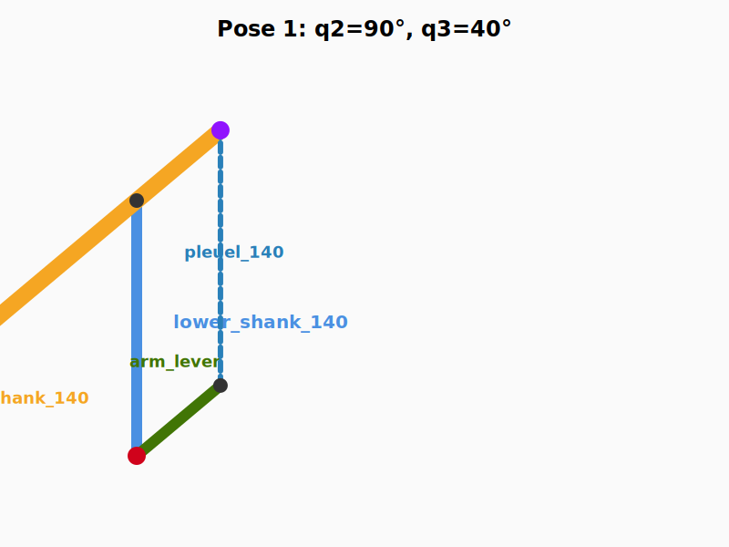
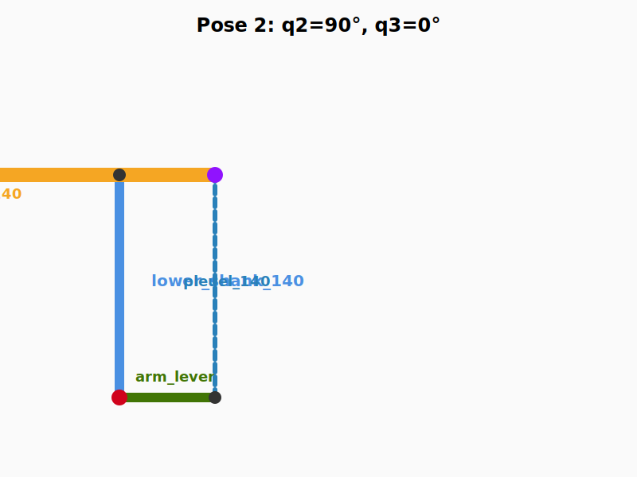

# Análisis Matemático de Cinemática: Brazo en Paralelogramo

Antes de escribir el código en Python, es vital entender las matemáticas del mecanismo. Como el URDF es una estructura de "árbol" (no admite bucles físicos cerrados), debemos forzar ángulos relativos en las articulaciones para que el mecanismo se comporte matemáticamente como un lazo cerrado perfecto.

## 1. Diagrama Gráfico y Topología

He dibujado el paralelogramo exacto que planteas, asumiendo que los motores de la base (Motor 2 y Motor 3) son **concéntricos** (comparten origen geométrico $O$). 

*   Lado A (Azul): **Lower Shank**, controlado por $q_2$.
*   Lado B (Verde): **Lever (Palanca)**, controlada por $q_3$.
*   Lado C (Azul, paralelo a Lado A): **Pleuel 140**.
*   Lado D (Verde, paralelo a Lado B): **Cola del Upper Shank**.

### Pose 1: Motor 3 bajo (20°)

### Pose 2: Motor 3 alto (80°)

Si la base fuera "desfasada" (es decir, el pivote azul no está pegado al verde en la base), la cola del Upper Shank no sería una pieza rígida física constante. Dado que es rígida, los pivotes base **deben ser concéntricos** (como se ilustra aquí con el punto rojo central).

## 2. Resolución Matemática del Paralelogramo

Para calcular cómo enviar los comandos de ángulo en tu `parallelogram_kinematics.py`, usemos la regla más importante de ROS URDF: 
**Los ángulos especificados en el código NO son absolutos respecto al suelo, sino RELATIVOS entre la pieza actual (hijo) y la pieza anterior (padre).**

Denotemos los ángulos dados por la GUI (Control Maestro) como:
* $q_2$: Consigna Absoluta para Motor 2 (`Revolute 9_0`)
* $q_3$: Consigna Absoluta para Motor 3 (`Revolute 11_0`)

### Condición de Paralelismo Físico:
Si exigimos que la Biela (`pleuel_140`) sea **siempre paralela** al Brazo Inferior (`lower_shank_140`):
* Ángulo absoluto del `lower_shank_140` respecto a su base $= q_2$
* Ángulo absoluto del `pleuel_140` respecto al referencial espacial también debe ser $= q_2$

Idénticamente, debido a la geometría cerrada del modelo, los lados opuestos sufren la misma restricción:
* El ángulo absoluto de la palanca (`lever`) $= q_3$
* El ángulo absoluto del antebrazo (`upper_shank_140`) debe ser $= q_3$

### Ecuaciones de Cinemática Relativa (URDF):

Para que las piezas mantengan esos ángulos en el Mundo 3D, debemos enviar al publicador la **diferencia angular** que existe en los pivotes móviles del sistema.

**Pivote `Rev 16` (El Codo):** Conecta `upper_shank_140` (hijo) con `lower_shank_140` (padre).
$$ Ang_{Rev16} = \text{AngAbs}(upper\_shank) - \text{AngAbs}(lower\_shank) $$
$$ \boldsymbol{Ang_{\text{Rev16\_0}} = q_3 - q_2} $$

**Pivote `Rev 12` (Base de la Biela):** Conecta `pleuel_140` (hijo) con `lever` (padre).
$$ Ang_{Rev12} = \text{AngAbs}(pleuel\_140) - \text{AngAbs}(lever) $$
$$ \boldsymbol{Ang_{\text{Rev12\_0}} = q_2 - q_3} $$
