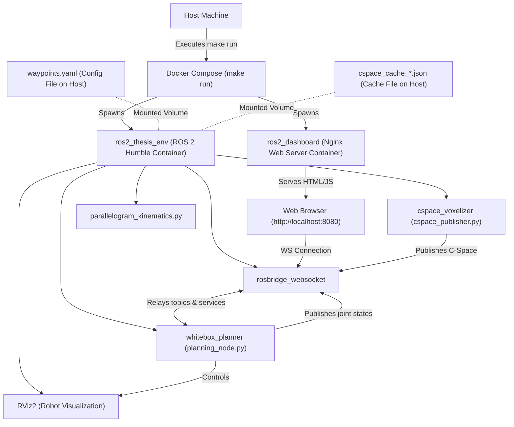
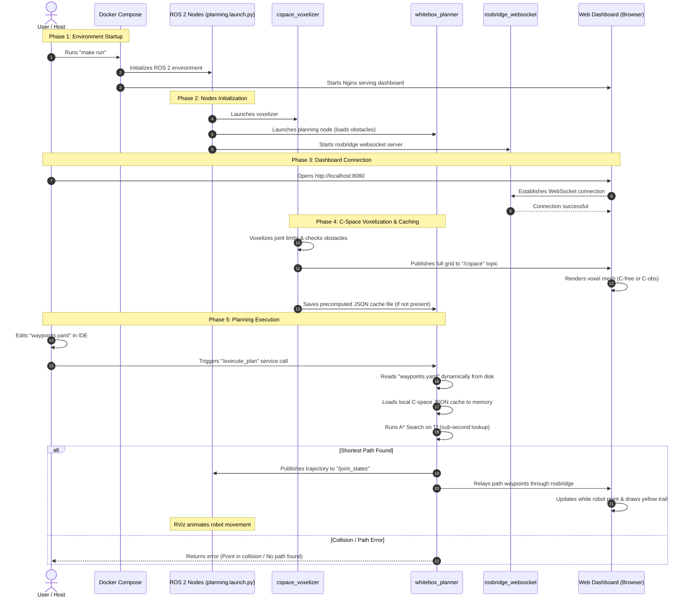

# Topological Navigation System Workflow

This document provides a comprehensive overview of the system's architecture and runtime sequence, mapping out how the Docker containers, ROS 2 nodes, configuration files, and the Three.js Web Dashboard interact from initial startup to trajectory execution.

---

## 1. System Architecture Flow

The following flow diagram illustrates the components initialized upon starting the environment and how data flows between the host machine, the Docker containers, and the browser.

---

## 2. Startup & Execution Sequence

This sequence diagram details the exact order of events from booting up the environment to initiating a robot motion trajectory.

---

## 3. Key Concept Highlights

* **Mermaid (not Marmot):** Using Mermaid diagrams is the standard and cleanest way to document structures inside markdown files. They render directly in markdown viewers (including GitHub and VS Code).
* **Dynamic Loading:** The `waypoints.yaml` file is read *directly from the mounted disk* on every `/execute_plan` trigger, meaning there is no caching of the YAML contents between launches.
* **Cache Efficiency:** Pre-rendering the C-space coordinates into a `json` file allows $O(1)$ set lookups during A* search, eliminating the need to perform expensive 3D collision checks at runtime.

---

## 4. Codebase Navigation Guide

To follow the data flow and understand the mathematical computations, here is a structured guide on the main files to read first:

### 1. Orchestration (Starting Point)
* **[planning.launch.py](file:///media/rc/SSD_DATOS/workspace/ROS2/src/whitebox_motion_planners/launch/planning.launch.py)**
  - **Purpose:** The ROS 2 launch file. It orchestrates all nodes, hooks up parameter configurations (like `planner_params.yaml`), and sets up RViz2 and rosbridge.

### 2. ROS 2 Node Layer (Communication API)
* **[planning_node.py](file:///media/rc/SSD_DATOS/workspace/ROS2/src/whitebox_motion_planners/whitebox_motion_planners/ros2/planning_node.py)** *(Main Controller)*
  - **Purpose:** Implements the `whitebox_planner` node. It hosts the `/execute_plan` service, reads `waypoints.yaml` dynamically on every trigger, runs A* search, and publishes trajectories to `/joint_states`.
* **[cspace_publisher.py](file:///media/rc/SSD_DATOS/workspace/ROS2/src/whitebox_motion_planners/whitebox_motion_planners/ros2/cspace_publisher.py)**
  - **Purpose:** Implements the offline/online voxelizer node. It evaluates the grid for self-collisions and environment obstacles, publishes the grid to `/cspace`, and saves the cache JSON file (`cspace_cache_*.json`).

### 3. Pure Algorithmic Layer (Mathematics)
These modules are independent of ROS 2 and contain core geometric and planning computations:
* **[a_star.py](file:///media/rc/SSD_DATOS/workspace/ROS2/src/whitebox_motion_planners/whitebox_motion_planners/planners/a_star.py)**
  - **Purpose:** Implements A* graph search on the toroidal manifold $T^n$, expanding neighbor grid configurations and computing shortest paths.
* **[foam_collider.py](file:///media/rc/SSD_DATOS/workspace/ROS2/src/whitebox_motion_planners/whitebox_motion_planners/collision/foam_collider.py)**
  - **Purpose:** Performs collision detection. When the JSON cache is loaded, it executes $O(1)$ set lookups on `forbidden_set` instead of running full geometric checks.
* **[grid_discretizer.py](file:///media/rc/SSD_DATOS/workspace/ROS2/src/whitebox_motion_planners/whitebox_motion_planners/collision/grid_discretizer.py)**
  - **Purpose:** Handles mapping continuous joint configurations (radians) to integer grid bins, computing wrap-around neighbors under the toroidal topology.

### 4. Visual Frontend (Dashboard)
* **[App.jsx](file:///media/rc/SSD_DATOS/workspace/ROS2/dashboard/src/App.jsx)**
  - **Purpose:** Client-side React & Three.js visualizer. Subscribes to `/cspace` and `/joint_states` via WebSockets (rosbridge) to render the 3D fundamental cube, the voxel cloud, and the live trajectory path.

Hola